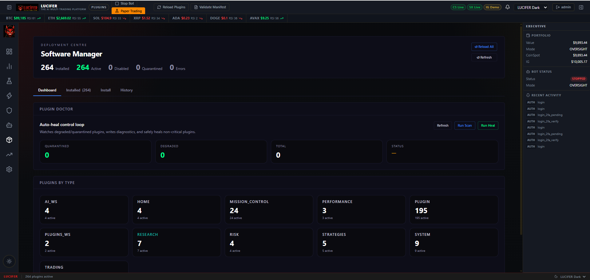

# LUCIFER Plugin Catalogue

> **264+ active plugins** · WordPress-style auto-discovery · No restart required to add a plugin

---

## How the Plugin System Works

LUCIFER's plugin system is modelled on WordPress. Every feature — exchanges, AI agents, data sources, indicators, strategies, risk rules, notifications, and dashboard widgets — is a plugin.

A plugin is a folder containing three files:

```
src/plugins/<category>/<plugin_name>/
  plugin.json    — metadata: name, label, category, widget slot, enabled flag
  api.py         — Flask Blueprint (backend API routes)
  widget.jsx     — React component (dashboard widget)
```

At startup, the platform scans `src/plugins/**` and auto-registers every folder that contains a valid `plugin.json`. No manual registration. No config file to edit. Drop the folder in, restart, and the plugin appears in the dashboard.

Plugins can be:
- **Enabled / disabled** from the Plugin Manager without touching code
- **Certified** — marked as production-ready after passing quality checks
- **Categorised** — exchanges, ai, data_sources, indicators, strategies, risk_rules, notifications, services

---

## Plugin Manager

The Plugin Manager is accessible from the Settings workspace. It shows:
- All installed plugins with their category, version, and enabled/disabled state
- Enable / disable toggle per plugin (takes effect on next bot cycle)
- Certified badge for plugins that have passed quality review
- Plugin count by category



---

## Plugin Doctor

The Plugin Doctor scans all installed plugins and produces a health report:

| Check | What It Looks For |
|---|---|
| **Missing files** | `plugin.json`, `api.py`, or `widget.jsx` absent |
| **Invalid JSON** | Malformed `plugin.json` |
| **Missing fields** | Required fields not present in `plugin.json` |
| **Category mismatch** | `plugin.json` category doesn't match folder location |
| **Import errors** | Python errors caught when loading `api.py` at startup |
| **Blueprint conflicts** | Two plugins registering the same API route |

Results are colour-coded — red (broken), amber (warning), green (passing). Run it any time from Settings → Plugin Doctor.

---

## Exchange Plugins

Each exchange plugin manages its own authentication, order placement, lot tracking, and P&L accounting independently.

### CoinSpot (`coinspot` / `coinspot_exchange`)
- **Exchange**: CoinSpot (Australia)
- **Asset class**: Cryptocurrency (AUD pairs)
- **API**: CoinSpot V2 REST API
- **Auth**: API key + HMAC secret
- **Order types**: Market orders (instant buy/sell)
- **Features**: Lot-based FIFO buy tracking, realised P&L per lot, nonce-locked to prevent race conditions, auto-cancel of stale open orders after configurable hours
- **Fee**: 0.01% per side (0.02% round-trip)
- **Status**: Active — primary crypto exchange

### Swyftx (`swyftx` / `swyftx_exchange`)
- **Exchange**: Swyftx (Australia)
- **Asset class**: Cryptocurrency (AUD pairs)
- **API**: Swyftx REST API
- **Auth**: JWT token
- **Features**: Full order management, lot tracking, P&L
- **Status**: Active

### Bybit (`bybit` / `bybit_exchange`)
- **Exchange**: Bybit
- **Asset class**: Cryptocurrency (USDT pairs)
- **API**: Bybit V5 REST API
- **Auth**: API key + secret
- **Order types**: Spot trading
- **Status**: Active

### IG Markets (`ig` / `ig_exchange`)
- **Exchange**: IG Markets
- **Asset class**: CFDs and commodities (COCOA, COFFEE, CORN, WHEAT, COPPER, XAGAUD, and more)
- **API**: IG REST API
- **Auth**: API key + username + password (DEMO or LIVE account)
- **Features**: Tiered position holdings with configurable target sizes, full open position tracking, stop/limit order support, P&L per position
- **Account types**: DEMO (default for testing) or LIVE
- **Status**: Active — commodity and CFD trading

### Paper Exchange (`paper_exchange`)
- **Purpose**: Full simulation using real live market data
- **Simulates**: All exchanges simultaneously
- **Features**: Real AI gate decisions, real strategy signals, real P&L tracking — no real orders placed
- **Use**: Default mode for new installations. Switch to live when ready.

### Coming Soon (Stubs)
| Plugin | Exchange | Status |
|---|---|---|
| `binance_exchange` | Binance | Stub — not yet enabled |
| `kraken_exchange` | Kraken | Stub — not yet enabled |
| `ib_exchange` | Interactive Brokers | Stub — not yet enabled |

---

## AI Plugins

### Ollama Integration (`ollama`)
Core local LLM integration. Routes all AI calls to the local Ollama server running at `http://localhost:11434`. Handles model selection, timeout management, fallback to `phi3:mini` when the primary model times out, and response parsing.

Primary models:
- `llama3.1:8b` — main pre-trade gate model
- `phi3:mini` — fast fallback on timeout
- `qwen3-coder:30.5b` — vision-capable model for chart analysis

### Local Ollama Advisor (`local_ollama_advisor`)
The **Pre-Trade Gate** — validates every proposed trade before execution.

How it works:
1. Receives the trade proposal: coin, amount, current RSI, EMA direction, MACD, Fear & Greed, strategy name
2. Constructs a prompt using the editable `pretrade_gate` system prompt
3. Calls Ollama with the trade data
4. Parses the JSON response: `{approved: true/false, confidence: 0-100, reasoning: "...", action: "BUY/SELL/HOLD"}`
5. If `approved: false`, the trade is blocked. The reasoning is logged to the Reasoning Bank.

The system prompt explicitly prohibits vague reasoning — the LLM must reference specific indicator values and risk factors. Responses like "looks good" are rejected.

### Claude Advisor (`claude_advisor`)
Cloud AI gate using the Anthropic Claude API as an alternative to local Ollama. Requires an `ANTHROPIC_API_KEY` in `.env`. Used when local LLMs are not available or when higher reasoning quality is needed for high-stakes decisions.

### Ensemble Voting (`ensemble`)
Combines signals from multiple strategies into a weighted vote. Each strategy gets a vote weight based on its recent win rate. The ensemble decision is the weighted majority. Reduces noise from individual strategy signals on volatile days.

### AI Chat Assistant (`ai_chat_assistant`)
An in-dashboard AI chat interface. Ask questions about the bot's performance, request analysis of recent trades, or get explanations of strategy decisions. Uses the local Ollama model by default; Claude API if configured.

### LLM Prompt Editor (`llm_prompts`)
Edit all AI system prompts from the dashboard. No Python files, no restart.

**Editable prompts:**

| Key | Agent | What It Controls |
|---|---|---|
| `prebuy_filter` | Legacy single-agent filter | The original single-LLM pre-buy decision (BUY/SKIP) |
| `agent_technical` | Technical analysis agent | How the Technical agent evaluates RSI, MACD, EMA, SuperTrend, ADX |
| `agent_sentiment` | Sentiment analysis agent | Fear & Greed rules, macro alert rules, news interpretation |
| `agent_risk` | Risk management agent | Drawdown, exposure, concentration, fee considerations |
| `agent_vision` | Vision agent | Chart pattern identification instructions |
| `pretrade_gate` | Pre-Trade Gate | Final approve/block decision with structured reasoning |
| `visual_agent` | Visual Agent page | Chart screenshot analysis instructions |

Each prompt shows its DEFAULT or CUSTOM status. Changes save to `data/llm_prompts.json` and take effect on the next trade.

---

## Data Source Plugins

These plugins fetch external data and make it available to strategies, AI agents, and the dashboard.

| Plugin | Data | Source | Update Frequency |
|---|---|---|---|
| `fear_greed` | Crypto Fear & Greed Index (0–100) with label | Alternative.me | Every 30 minutes |
| `crypto_news` | Latest cryptocurrency news aggregated from multiple feeds | Multiple RSS + APIs | Every 15 minutes |
| `rss_crypto_news` | Raw RSS crypto news parser — CoinDesk, Cointelegraph, Decrypt | RSS feeds | Every 15 minutes |
| `macro_news` | Macroeconomic and geopolitical headlines tagged MACRO/ | Financial news APIs | Every 30 minutes |
| `sentiment_snapshot` | Point-in-time composite sentiment score | Internal aggregation | Per request |
| `reddit_sentiment` | Sentiment scoring from r/CryptoCurrency, r/Bitcoin, r/ethereum | Reddit API | Every hour |
| `influencer_feed` | Post monitoring for major crypto influencers | Social APIs | Every 30 minutes |
| `coingecko_intel` | Trending coins, top gainers/losers, market caps | CoinGecko API | Every 15 minutes |
| `market_chart` | OHLC candle data and price history for charting | Exchange APIs | Real-time |
| `deribit_feed` | Options data — implied volatility, put/call ratio, open interest | Deribit API | Every 15 minutes |
| `derivatives_feed` | Futures funding rates, open interest across major venues | Multiple APIs | Every 15 minutes |
| `onchain_macro_feed` | On-chain indicators — whale movements, exchange inflows/outflows, HODL waves | Glassnode / on-chain APIs | Every hour |
| `system_health_monitor` | CPU %, RAM %, disk usage, process uptime | Windows system calls | Every 60 seconds |

---

## Indicator Plugins

Technical indicators computed on price data and exposed to strategies via the indicator registry.

| Plugin | Indicator | Key Parameters |
|---|---|---|
| `rsi` | Relative Strength Index | Period (default 14); <30 oversold, >70 overbought |
| `ema` | Exponential Moving Average | Period (configurable — 9, 21, 50 common) |
| `sma` | Simple Moving Average | Period (configurable) |
| `macd` | MACD line, signal line, histogram | Fast 12, slow 26, signal 9 (defaults) |
| `bollinger_bands` | Upper/lower bands + middle band | Period 20, stddev 2.0 (defaults) |
| `atr` | Average True Range — volatility measurement | Period 14 |
| `adx` | Average Directional Index + DI+/DI- | Period 14; >25 = strong trend |
| `supertrend` | SuperTrend directional signal (bullish/bearish) | Period 10, multiplier 3.0 |
| `stochastic_rsi` | Stochastic RSI oscillator (K/D lines) | RSI period 14, stoch period 14 |
| `ichimoku` | Ichimoku Cloud — Tenkan, Kijun, Senkou A/B, Chikou | Standard 9/26/52 periods |
| `vwap` | Volume Weighted Average Price — intraday mean reversion anchor | Resets daily |
| `obv` | On-Balance Volume — volume-based momentum | Cumulative |
| `swing_failure_pattern` | SFP detection — liquidity sweep that reverses | Configurable lookback |
| `functional` | Utility helpers — rolling window functions, cross-over detection, divergence checks | — |

---

## Risk Rule Plugins

Risk rules are evaluated on every potential trade. If any mandatory rule fails, the trade is blocked regardless of AI or strategy signal.

### Core Risk Rules (`core`)
The foundational risk layer:
- **Max daily drawdown** — if portfolio loses more than X% today, trading stops until tomorrow
- **Max total exposure** — caps total AUD committed to open positions
- **Max position count** — limits number of simultaneous open positions
- **Min trade size** — rejects trades below the minimum to avoid fee erosion
- **Coin blacklist** — configurable list of coins to never trade
- **Spread check** — verifies that the spread plus fees doesn't erase the expected edge

### Fear-Weighted DCA (`fear_dca`)
Scales DCA buy amounts with the Fear & Greed index:
- Extreme Fear (≤ 25): multiply buy size by a configured upscale factor — statistically better entries
- Fear (26–45): slight upscale
- Neutral (46–55): standard size
- Greed (56–75): standard or slight reduction
- Extreme Greed (≥ 76): reduce buy size — contrarian caution

### Standard DCA (`dca`)
Dollar-cost averaging on price dips. Buys additional lots when price drops a configured percentage from the last buy. Configurable maximum lot count and minimum time between buys.

### Trailing Stop-Loss (`trailing_stop`)
Once a position reaches a configured profit threshold, the trailing stop activates:
- Trail percentage configurable per exchange
- Automatically updates the stop level as price moves up
- Triggers sell when price falls back through the trailing level

### Sell Decision Engine (`sell_decision`)
Lot-based FIFO sell logic:
- Identifies which lots to sell based on age (oldest first) or profit threshold
- Calculates realised P&L per lot
- Handles partial sells (sell only the profitable lots, hold the rest)
- Integrates with take-profit targets and trailing stops

---

## Notification Plugins

### Telegram (`telegram` / `telegram_notification`)
Primary notification channel. Sends:
- Trade executed (buy or sell) with full details
- AI gate decision — approved or blocked, with reasoning summary
- Daily P&L report (configurable time)
- Stop-loss and trailing stop events
- System health warnings (high CPU/RAM, process crash)
- Bot started / stopped
- 2FA codes when logging into the dashboard
- Strategy change notifications

Configuration: `TELEGRAM_BOT_TOKEN` and `TELEGRAM_CHAT_ID` in `.env`.

### Webhook (`webhook_notification`)
Generic outbound webhook. POSTs a JSON payload to any configured URL on trade events. Use for integrating with Slack, Discord, custom dashboards, or any webhook-capable service.

---

## Service Plugins

### Exchange Ledger Sync (`exchange_ledger_sync`)
Reconciles the local trade ledger against each exchange's official trade history:
- Fetches trade history from exchange APIs
- Compares against local `data/` records
- Flags discrepancies
- Can import missing trades from the exchange into the local ledger

---

## Adding a New Plugin

1. Create the folder: `src/plugins/<category>/<plugin_name>/`
2. Write `plugin.json`:

```json
{
  "name": "my_plugin",
  "label": "My Plugin",
  "description": "What this plugin does in one sentence.",
  "version": "1.0.0",
  "author": "Your Name",
  "enabled": true,
  "certified": false,
  "category": "data_sources",
  "widget": {
    "component": "MyPluginWidget",
    "slot": "data-my-plugin",
    "file": "widget.jsx"
  }
}
```

3. Write `api.py` — a Flask Blueprint:

```python
from flask import Blueprint, jsonify
bp = Blueprint("my_plugin", __name__)

@bp.route("/api/my-plugin/data", methods=["GET"])
def get_data():
    return jsonify({"value": 42})
```

4. Write `widget.jsx` — a React component:

```jsx
export function MyPluginWidget() {
  return <div>My Plugin</div>;
}
```

5. Restart the dashboard. The plugin appears automatically.

Valid categories: `exchanges`, `ai`, `data_sources`, `indicators`, `strategies`, `risk_rules`, `notifications`, `services`

---

*For a full list of strategy plugins, see [STRATEGIES.md](STRATEGIES.md)*
