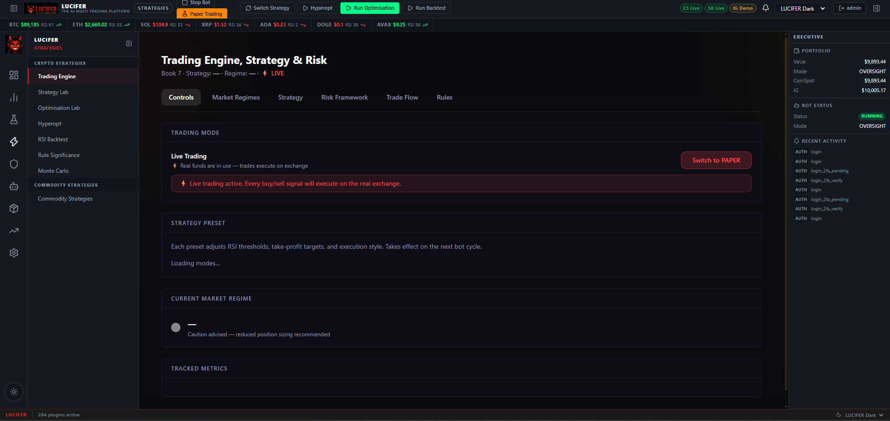
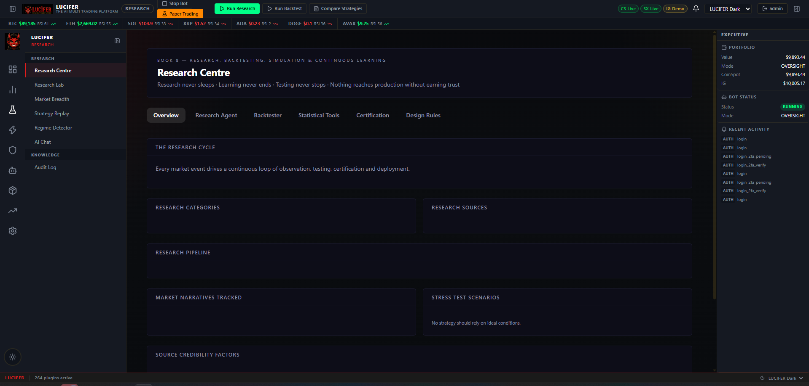
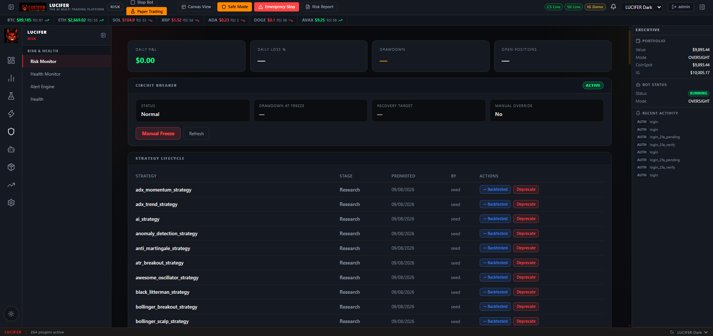
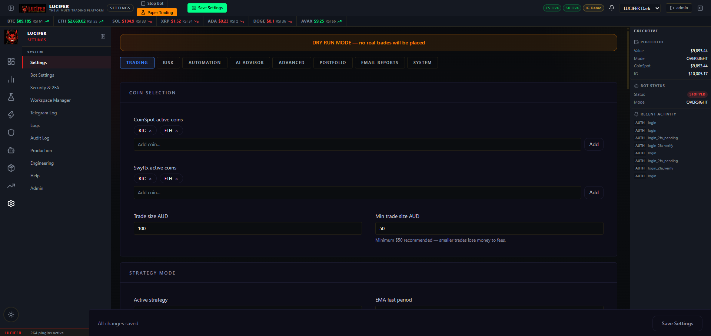
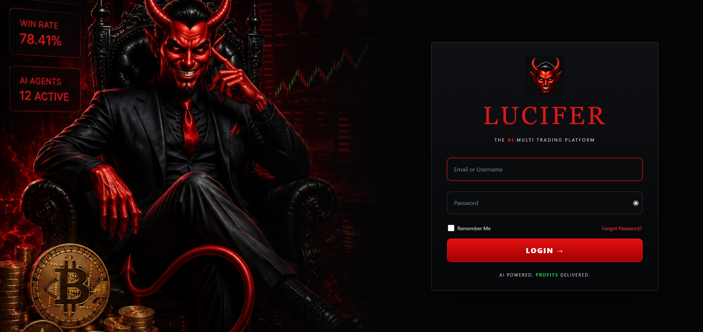

# LUCIFER — The AI Multi-Trading Platform

> **Version**: v2.0 &nbsp;|&nbsp; **Updated**: August 2026 &nbsp;|&nbsp; **Status**: Active Development &nbsp;|&nbsp; **Plugins**: 264+ active

LUCIFER is a self-hosted, plugin-based automated trading platform for cryptocurrency and CFD/commodity markets. It runs 24/7 on a dedicated Windows machine, trades across four exchanges simultaneously, and manages every trade through a layered AI gate, strategy engine, and continuous research pipeline.

It is not a simple script. It is a full trading operating system — with a professional dashboard, autonomous research agent, 139+ certified strategy plugins, a 4-agent AI pre-buy panel, and a plugin architecture modelled on WordPress that makes every feature independently extensible.

---

## What It Does

| Capability | Detail |
|---|---|
| **Multi-exchange trading** | CoinSpot, Swyftx, Bybit (crypto) · IG Markets (CFDs/commodities) |
| **AI pre-trade gate** | 4-agent panel (Technical · Sentiment · Risk · Vision) + local LLM gate before every trade |
| **139+ strategies** | Crypto and CFD/commodity strategies — momentum, mean reversion, ML, regime-aware, SMC, arbitrage |
| **Research pipeline** | Autonomous AI research agent, backtester, statistical tools, strategy certification |
| **Risk management** | Stop-loss, trailing stops, fear-weighted DCA, drawdown limits, regime detection |
| **HTTPS Dashboard** | React + Flask · 9 workspaces · 5 themes · mobile-responsive |
| **Plugin system** | WordPress-style auto-discovery — 264+ active plugins, add new ones without restart |
| **Paper trading** | Full dry-run mode — real market data, zero real money |
| **Telegram alerts** | Trade signals, AI decisions, daily P&L reports, system health, 2FA codes |
| **IG Markets** | Tiered commodity holdings (COCOA, COFFEE, CORN, WHEAT, COPPER, XAGAUD etc.) with full P&L |
| **Reasoning Bank** | Every AI decision is logged, outcome-tracked, and available for review |
| **Visual Agent** | Upload a chart screenshot — AI reads and interprets it |
| **LLM Prompt Editor** | Edit every AI system prompt from the dashboard. No restart, no code changes |

---

## Architecture Overview

```
┌─────────────────────────────────────────────────────────────────────────┐
│                          LUCIFER Platform                               │
├──────────────────┬──────────────────┬──────────────────────────────────┤
│   Trading Engine │  Research        │  Dashboard                        │
│                  │  Pipeline        │  React 18 + Flask                 │
│  bot.py          │                  │                                   │
│  services/       │  research/       │  9 Workspaces                     │
│  strategies/     │  backtester/     │  264+ Plugin Widgets              │
│  risk engine     │  optimize/       │  5 Themes                         │
├──────────────────┴──────────────────┴──────────────────────────────────┤
│                         Plugin System                                   │
│  264+ plugins auto-discovered from src/plugins/**                      │
│  plugin.json + api.py + widget.jsx = complete feature                  │
├───────────────────────────────────┬─────────────────────────────────────┤
│  Exchanges                        │  AI / LLM                           │
│  CoinSpot · Swyftx · Bybit · IG   │  Ollama (local) — llama3.1, phi3   │
│  Paper exchange (dry-run)         │  Claude API (cloud, optional)       │
├───────────────────────────────────┴─────────────────────────────────────┤
│  Data Sources                                                           │
│  Fear & Greed · Crypto News · Macro News · Reddit · Deribit            │
│  CoinGecko · On-chain · Derivatives · Influencer · System Health       │
└─────────────────────────────────────────────────────────────────────────┘
```

---

## Dashboard — 9 Workspaces

The LUCIFER dashboard is a full web application served over HTTPS on port 5443. It is accessible from any browser on the local network (or remotely via port forwarding or VPN). It supports 5 colour themes and is mobile-responsive.

### 1. Mission Control
The central command hub — everything at a glance.
- **Exchange Accounts** — live balance, holdings cost, total value, and P&L for each exchange (CoinSpot, Swyftx, Bybit, IG Markets) in individual cards
- **Open Positions** — all open trades across all exchanges in a single unified table: symbol, direction, size, entry price, stop, limit, and time opened
- **Recent Trades** — filterable by exchange (ALL / COINSPOT / SWYFTX / BYBIT / IG MARKETS), showing time, symbol, side, price, quantity, amount AUD, and realised P&L
- **Bot Status** — live running/stopped state, current mode (OVERSIGHT / PAPER / LIVE)
- **Portfolio Summary** — total value, per-exchange breakdown


### 2. Markets
Live market data and sentiment across all tracked coins and instruments.
- Live price ticker for BTC, ETH, SOL, XRP, ADA, DOGE, AVAX with RSI
- Price charts with configurable timeframes and indicators
- Market breadth — how many coins are trending bullish vs bearish
- Sentiment snapshot — Fear & Greed, news sentiment, social volume
- Regime detector — current market regime (trending / ranging / high volatility)

### 3. Strategies
Full strategy management for both crypto and commodity asset classes.
- **Trading Engine** — live controls: switch between LIVE/PAPER, current strategy, regime display
- **Strategy Lab** — browse and compare all 139+ strategies with performance metrics
- **Optimisation Lab** — parameter optimisation for any strategy
- **Hyperopt** — Optuna-powered hyperparameter search with configurable trial counts
- **RSI Backtest** — dedicated RSI strategy historical backtester
- **Rule Significance Testing** — statistical validity check for strategy rules
- **Monte Carlo Simulation** — simulate thousands of equity curve scenarios
- **Commodity Strategies** — dedicated view for IG Markets CFD strategies



### 4. Research
The autonomous research pipeline — the platform learns and improves itself.
- **Research Centre Overview** — research cycle status, categories, pipeline, narratives tracked, stress test scenarios
- **Research Agent** — autonomous AI that runs every night at 3am AEST. Analyses bot performance, detects weaknesses, generates research projects, tests hypotheses, and promotes successful strategies to production. Shows live output during a manual run cycle.
- **Backtester** — per-strategy historical testing with configurable date range, symbol, and timeframe
- **Statistical Tools** — Hurst exponent (trend persistence), Monte Carlo, rule significance, regime analysis
- **Strategy Certification** — formal pass/fail gate. A strategy must pass before it reaches the live trading engine
- **Design Rules** — the platform's trading design principles and constraints




### 5. AI
Everything related to AI decision-making.
- **Pre-Buy Panel** — shows the 4-agent decisions (Technical, Sentiment, Risk, Vision) for the last trade evaluated, with individual agent reasoning
- **Reasoning Bank** — every AI gate decision ever made, with full reasoning, signal data (RSI, price, EMA, MACD, Fear & Greed), outcome (WIN/LOSS/PENDING), P&L %, trade ID. Filterable by agent, outcome, and search text
- **Visual Agent** — upload or paste a chart screenshot. The AI analyses it and returns trend, patterns, support/resistance levels, indicator readings, a signal (BUY/SELL/HOLD), and detailed reasoning
- **LLM Prompt Editor** — edit the system prompt for every AI agent in the platform. Shows DEFAULT vs CUSTOM status for each prompt. Changes take effect immediately without restart

### 6. Risk
Risk management configuration and monitoring.
- Risk framework settings — max drawdown, exposure limits, position concentration
- Trailing stop configuration
- DCA rules — standard and fear-weighted variants
- Regime detector — current detected regime and its effect on position sizing



### 7. Exchange
Per-exchange detail views.
- Order book and open orders per exchange
- Full trade history with export
- Ledger sync — reconcile the local ledger against the exchange's records
- Fee tracking

### 8. Settings
All platform configuration in one place.
- **Trading** — coin selection per exchange, trade size, strategy mode, EMA periods
- **Risk** — stop-loss, trailing stop, drawdown limits, exposure caps
- **Automation** — scheduled jobs, auto-restart rules
- **AI Advisor** — enable/disable 4-agent panel, pre-trade gate, model selection
- **Advanced** — timeframes, candle counts, technical thresholds
- **Portfolio** — IG tiered holdings configuration
- **Email Reports** — daily/weekly P&L report configuration
- **System** — logging levels, supervisor settings, process management



### 9. Engineering
Internal platform health for developers.
- Blueprint compliance percentage
- Technical debt inventory
- Event bus health
- Service and plugin health
- Database status
- Migration progress

---

## AI System — How It Works

### The 4-Agent Pre-Buy Panel

Before every buy order is placed, four AI agents run in parallel using a local Ollama LLM. Each agent returns a signal, confidence score, and mandatory reasoning:

| Agent | What It Analyses | Signal Format |
|---|---|---|
| **Technical** | RSI, MACD, EMA crossovers, SuperTrend, ADX, Bollinger Bands, volume | BUY / SKIP + confidence + reason |
| **Sentiment** | Fear & Greed index, news, macro events (with F&G rules and macro alerts) | BULLISH / BEARISH / NEUTRAL + confidence |
| **Risk** | Drawdown, exposure, position concentration, fees, regime | APPROVE / REJECT + confidence |
| **Vision** | Chart screenshot pattern recognition (optional) | BUY / SKIP + confidence + pattern name |

The results of all four agents feed into a **Pre-Trade Gate** — a fifth LLM call that synthesises all four signals and makes the final approve/block decision with structured JSON output including a 2–4 sentence mandatory reasoning paragraph. Vague responses like "looks good" are explicitly prohibited by the system prompt.

### Reasoning Bank
Every AI gate decision is stored permanently with:
- Full reasoning text
- Signal inputs (RSI value, price, EMA direction, MACD, strategy, Fear & Greed)
- Outcome label (WIN / LOSS / PENDING) once the trade closes
- Realised P&L %
- Trade ID for cross-reference
- Judge metadata

This creates a growing memory of what the AI decided and whether it was right — enabling outcome-based learning and prompt refinement.

### Visual Agent
A standalone dashboard tool that accepts:
- Drag-and-drop image upload
- File browser selection
- Ctrl+V clipboard paste

The chart image is sent to a local vision-capable LLM (`qwen3-coder:30.5b`) which returns a structured analysis: trend, chart patterns, support/resistance levels, visible indicator readings, a BUY/SELL/HOLD signal, and reasoning.

### LLM Prompt Editor
All seven AI system prompts are editable from the dashboard without touching Python files:
- Default prompts are built into the code as fallbacks
- Overrides are saved to `data/llm_prompts.json`
- Changes take effect on the next trade — no restart needed
- Each prompt shows DEFAULT or CUSTOM status
- Any prompt can be reset to its default with one click

---

## Risk Management

LUCIFER has multiple layers of risk management that operate independently:

**Pre-trade AI gate** — every buy must be approved by the LLM gate before execution. If the gate blocks, the trade does not happen.

**Stop-loss** — configurable per-trade stop-loss with a buffer percentage. Applied automatically on open.

**Trailing stop-loss** — once a trade is profitable, a trailing stop locks in gains. Configurable trail percentage and activation threshold.

**Daily drawdown limit** — if the bot loses more than a configured percentage of portfolio value in a single day, trading pauses automatically until the next day.

**Position concentration limit** — caps how much of the portfolio can be in any single asset.

**Fear-weighted DCA** — the DCA buy amount scales with the Fear & Greed index:
- Extreme Fear (≤ 25): buy more — statistically a better entry
- Greed (56–75): buy normal size
- Extreme Greed (≥ 76): reduce buy size — contrarian caution

**Regime detection** — the platform detects whether the market is trending, ranging, or in high volatility, and adjusts position sizing and strategy selection accordingly.

**Lot-based FIFO accounting** — every buy creates a lot. Sells consume the oldest lots first (FIFO). Realised P&L is calculated per lot, ensuring accurate per-trade profit tracking regardless of averaging down.

---

## Paper Trading

Paper trading is a full simulation mode using real live market data:
- Toggle it from the ribbon bar ("Paper Trading" button) — no settings change needed
- All AI agents still run and make real decisions
- All strategies still generate signals
- All risk rules still apply
- P&L is tracked as if trades were real
- Telegram alerts still fire
- The Reasoning Bank still records every decision

The only difference: no real orders are placed on exchanges.

This makes paper trading genuinely useful for validating the bot's behaviour before going live, not just a basic simulation with dummy data.


---

## Research Pipeline — How Strategies Are Born

No strategy goes live without passing through the research pipeline:

```
Research Agent detects weakness or opportunity
         ↓
Research project created (hypothesis + test plan)
         ↓
Strategy plugin created (one .py file + plugin.json)
         ↓
Backtested against historical data
         ↓
Statistical significance tested (rule significance, Hurst)
         ↓
Monte Carlo simulation (equity curve stress test)
         ↓
Strategy Certification (pass/fail gate)
         ↓
Deployed to Strategy Lab for paper trading
         ↓
Promoted to production after live paper-trade validation
```

The Research Agent runs automatically at 3am AEST daily and can also be triggered manually from the dashboard.

---

## Supervisor — How LUCIFER Runs 24/7

LUCIFER uses a PowerShell supervisor script (`scripts/supervisor.ps1`) that:
- Starts all configured processes at Windows login (no password prompt required)
- Monitors each process every 30 seconds
- Automatically restarts any process that crashes
- Logs all events to `logs/supervisor.log`

Processes supervised:
- `bot.py` — the main trading runtime
- `src/app.py` — the Flask dashboard server
- Any additional configured background services

Because it uses Task Scheduler (not a Windows Service), it works with the Microsoft Store Python restriction that prevents services from running without a password.

---

## Telegram Alerts

LUCIFER sends Telegram messages for:

| Alert Type | Content |
|---|---|
| **Trade executed** | Exchange, coin, direction, size, entry price, AI gate decision |
| **AI gate blocked** | Coin that was blocked and the LLM's reasoning |
| **Daily P&L report** | Portfolio value, daily change, per-exchange breakdown |
| **Stop-loss triggered** | Coin, exchange, loss amount, reason |
| **Trailing stop activated** | Coin, locked-in gain level |
| **Bot started / stopped** | Timestamp and mode |
| **System health warning** | High CPU/RAM, disk full, process crash |
| **2FA codes** | Sent to Telegram when logging into the dashboard |
| **Drawdown limit hit** | Total loss that triggered the pause |

---

## Security

- **HTTPS only** — dashboard served over TLS on port 5443. HTTP on port 5000 redirects automatically.
- **2FA** — TOTP-based two-factor authentication for dashboard login. 2FA codes are sent to Telegram.
- **JWT tokens** — all API requests require a signed JWT token. Tokens expire automatically.
- **Rate limiting** — login endpoint is rate-limited to prevent brute-force attacks.
- **Credentials in `.env`** — API keys and secrets are never in code. The `.env` file is in `.gitignore`.
- **mkcert TLS** — local Certificate Authority generates trusted certificates without a CA purchase.



---

## Technology Stack

| Layer | Technology |
|---|---|
| **Backend** | Python 3.11+ · Flask · APScheduler · threading |
| **Frontend** | React 18 · Vite · CSS Custom Properties (5 themes) |
| **Data store** | JSON flat-file store (`data/`) · SQLite for research and reasoning |
| **AI — local** | Ollama · llama3.1:8b (primary) · phi3:mini (fallback) · qwen3-coder:30.5b (vision) |
| **AI — cloud** | Anthropic Claude API (optional, for cloud AI gate) |
| **Exchanges** | CoinSpot V2 REST · Swyftx JWT REST · Bybit V5 REST · IG Markets REST |
| **TLS** | mkcert local CA · self-signed cert trusted by browser |
| **Notifications** | Telegram Bot API |
| **Optimisation** | Optuna (hyperparameter search) |
| **Statistical** | NumPy · pandas · scipy · statsmodels |
| **ML** | scikit-learn · XGBoost · (LSTM in strategies — PyTorch optional) |
| **Supervisor** | PowerShell · Windows Task Scheduler |

---

## System Requirements

| Component | Minimum | Recommended |
|---|---|---|
| **OS** | Windows 10 64-bit | Windows 11 Pro 64-bit |
| **CPU** | Intel Core i5 (any gen) | Intel Core i7 / AMD Ryzen 7 |
| **RAM** | 16 GB | **32 GB+** — recommended if running local LLMs |
| **Storage** | 250 GB free | 1 TB SSD — data accumulates over months |
| **GPU** | NVIDIA 8 GB VRAM | NVIDIA 8 GB+ VRAM — built and tested on RTX 5060 Ti |
| **Python** | 3.10+ | **3.11+** |
| **Node.js** | 18+ | **20 LTS** |
| **Ollama** | Required for AI | Latest |
| **Network** | Broadband | Broadband — static IP or DDNS for remote access |

> A dedicated always-on machine is strongly recommended. LUCIFER trades 24/7 and should not compete for resources with a workstation.

---

## Roadmap

### Completed ✅
- Multi-exchange trading — CoinSpot, Swyftx, Bybit, IG Markets
- 4-agent AI pre-buy panel (Technical, Sentiment, Risk, Vision)
- 139+ strategy plugins across crypto and commodity asset classes
- WordPress-style plugin system with auto-discovery (264+ plugins)
- React dashboard with 9 workspaces and 5 themes
- Research centre with autonomous AI research agent (3am AEST cycle)
- Strategy backtester, hyperopt, Monte Carlo, rule significance testing
- Strategy certification pipeline
- Paper trading mode (real data, zero real money)
- IG Markets tiered commodity holdings with full P&L
- Fear-weighted DCA
- LUCIFER rebrand
- Visual Agent — chart screenshot AI analysis
- Reasoning Bank — AI decision memory with outcome tracking
- LLM Prompt Editor — edit all AI prompts from dashboard
- Plugin Doctor — automated plugin health diagnostics
- Supervisor auto-restart at Windows login
- Mission Control movable/resizable widget cards

### In Progress 🔄
- Commodity strategy engines (carry, seasonal, relative value, term structure)
- Live buying validation — currently paper trading only; IG Markets demo account support in progress

### Planned 📋
- Mobile app (Android — PWA wrapper + Telegram push bridge)
- Telegram market breadth alerts
- AI tuner settings page
- Stop-loss exposure dashboard widget
- A/B testing framework for AI strategy prompts
- Browser push notifications

---

## Join the Team — Developers & Testers Wanted

LUCIFER is a privately developed platform actively looking for skilled contributors to help take it further. The codebase is private — this is not open source — but we are selectively onboarding developers and testers who want to work on something real and already running.

### What We're Looking For

**Backend Developers**
- Python developers experienced with Flask, async, REST APIs, or trading systems
- Quantitative / strategy developers — new strategy plugins, backtesting logic, optimisation
- AI / LLM engineers — prompt engineering, local model integration, agent design, reasoning systems

**Frontend Developers**
- React developers for dashboard features, new widgets, and the mobile PWA
- UI/UX contributors who understand trading dashboards and data-dense interfaces

**Testers**
- Manual testers who can run LUCIFER in paper-trading mode and report issues systematically
- People with access to CoinSpot, Swyftx, Bybit, or IG Markets for real-world testing
- Anyone with QA experience in financial software

**Infrastructure**
- Windows deployment, Task Scheduler, PowerShell automation
- Security review, TLS, authentication hardening

### What You Get
- Full access to the private codebase
- A real say in the roadmap and feature direction
- Experience building a live, production-grade trading platform across multiple asset classes
- Collaboration with a serious project that has been running and evolving for over a year

### How to Apply

Email **lucifersdevteam@gmail.com** with:
1. Your background — a few sentences is enough
2. Which area you want to contribute to
3. Any relevant work, GitHub profile, or examples

We read every application personally. We are not looking for everyone — just the right people.

---

## Licence

Private — all rights reserved. LUCIFER is not open source.

Contact: lucifersdevteam@gmail.com
